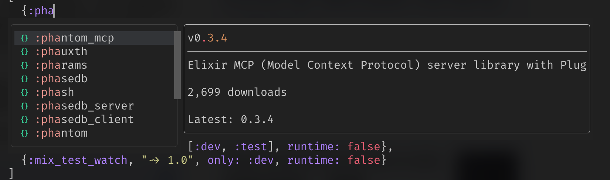
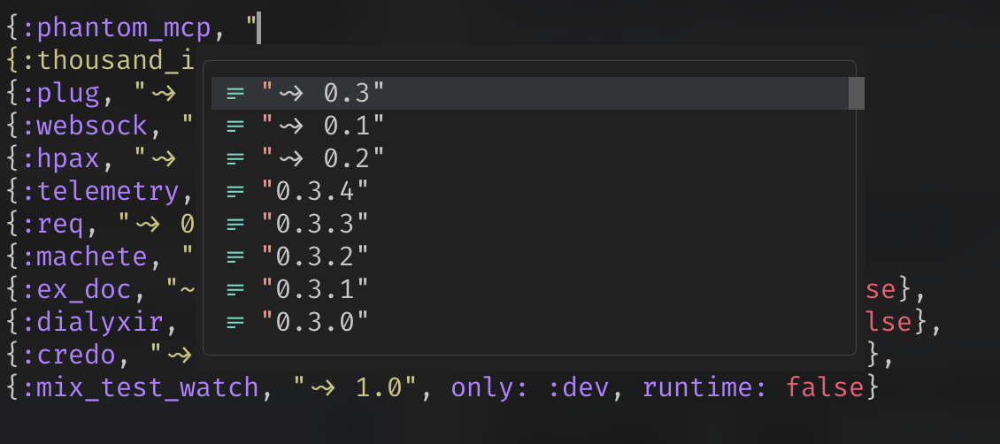

# hex-cmp

[blink.cmp](https://github.com/saghen/blink.cmp) source for [hex.pm](https://hex.pm) package completion in Elixir `mix.exs` files.





## Features

- **Package name completion** — search hex.pm as you type in the first position of a dep tuple
- **Version completion** — `~>` fuzzy versions and exact versions, with retired versions marked
- **Dependency opts completion** — all Mix.Project dependency options (`only:`, `git:`, `path:`, etc.)
- **Signature help** — `{app, requirement, opts}` with full documentation
- **Hover** — package description, version, downloads, license, and links via `K`
- **Disk cache** — responses cached with TTL, stale cache served on API failure

## Requirements

- Neovim >= 0.10
- [blink.cmp](https://github.com/saghen/blink.cmp)
- [tree-sitter-elixir](https://github.com/elixir-lang/tree-sitter-elixir) parser
- `curl` on PATH

## Installation

### lazy.nvim

Add hex-cmp as a dependency of blink.cmp:

```lua
{
  'saghen/blink.cmp',
  dependencies = {
    'dbernheisel/hex-cmp',
  },
  opts = {
    sources = {
      per_filetype = {
        elixir = { inherit_defaults = true, 'hex' },
      },
      providers = {
        hex = { name = "hex", module = "hex_cmp", async = true },
      },
    },
  },
}
```

### Hover

Add this to your LSP `on_attach` to get hex package info on `lsp.hover`
(typically mapped to `K`):

```lua
local bufname = vim.api.nvim_buf_get_name(bufnr)
if bufname:match('mix%.exs$') then
  require('hex_cmp.hover').attach(bufnr)
end
```

This starts a lightweight in-process LSP that only provides `textDocument/hover`. It works alongside your existing Elixir LSP — no keymap changes needed.

## Configuration

Options can be passed via the provider `opts`:

```lua
hex = {
  name = "hex",
  module = "hex_cmp",
  async = true,
  opts = {
    cache_ttl = 1800,    -- seconds (default: 1800 - 30 minutes)
    max_results = 50,   -- max search results (default: 50)
  },
},
```

## Health

Run `:checkhealth hex_cmp` to verify your setup.

## How it works

hex-cmp uses treesitter to detect when the cursor is inside a `defp deps` (or `def deps`) function in `mix.exs`. Based on the cursor position within the dep tuple:

| Position | Completion | Source |
|----------|-----------|--------|
| 1 — `:app` | Package names | hex.pm search API |
| 2 — `"requirement"` | `~>` and exact versions | hex.pm package API |
| 3+ — `opts` | Dependency keywords | Static (Mix.Project docs) |

API responses are cached to disk at `vim.fn.stdpath('cache') .. '/hex-cmp/'` with a configurable TTL. Stale cache is served as a fallback when the API is unreachable.
